```
$ whoami
```

<h1 align="center">Hi, I'm <a href="https://mahbodtajdini.com/">Mahbod</a> 👋</h1>

<p align="center">
  <a href="https://www.linkedin.com/in/mahbodtajdini">LinkedIn</a> &nbsp;•&nbsp;
  <a href="https://mahbodtajdini.com/MTajdini_CV.pdf">CV</a> &nbsp;•&nbsp;
  <a href="mailto:mahbodtajdini@gmail.com">Email</a>
</p>

---


- 🎓 &nbsp;MSc Data Science student at **ETH Zürich** & **University of Zürich**
- 🇨🇭 &nbsp;Based in Zürich, Switzerland
- 🔬 &nbsp;Research interests span **3D computer vision**, **mixed reality**, and **robot perception**
- 📫 &nbsp;Reach me at **<a href="mailto:mahbodtajdini@gmail.com">mahbodtajdini@gmail.com</a>**

<br clear="right">

<!-- Animated contribution graph (self-hosted SVG, refreshed daily by .github/workflows/update-profile-art.yml) -->
<p align="center">
  
</p>

<p align="center">
  
</p>

<p align="center">
  <a href="mailto:mahbodtajdini@gmail.com"></a>
  &nbsp;Open to collaboration ⟶ <a href="mailto:mahbodtajdini@gmail.com">Get in touch</a>
</p>
